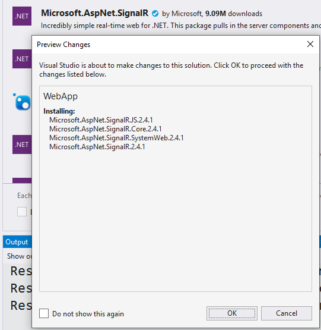

# Learn SignalR

> SignalR is available for both the .Net Framework and .Net Core. You can learn about the differences [here](https://docs.microsoft.com/en-us/aspnet/core/signalr/version-differences?view=aspnetcore-3.0). This repository explores [SignalR](https://docs.microsoft.com/en-us/aspnet/signalr/overview/getting-started/tutorial-getting-started-with-signalr-and-mvc) for the **.Net Framework** 4.7.2.

## NuGet Packages

## Security Articles

- [OWASP Top 10 for .NET developers part 5: Cross-Site Request Forgery (CSRF)](https://www.troyhunt.com/owasp-top-10-for-net-developers-part-5/)
- [Introducing you to browser security headers on Pluralsight](https://www.troyhunt.com/introducing-you-to-browser-security/)
- [Fixing Data Breaches Part 3: The Ease of Disclosure](https://www.troyhunt.com/fixing-data-breaches-part-3-the-ease-of-disclosure/) [:+1: Promo](https://twitter.com/troyhunt/status/959724034622595072?lang=en)
- [CSP, SRI and CORS](https://colorblindprogramming.com/csp-sri-and-cors)
